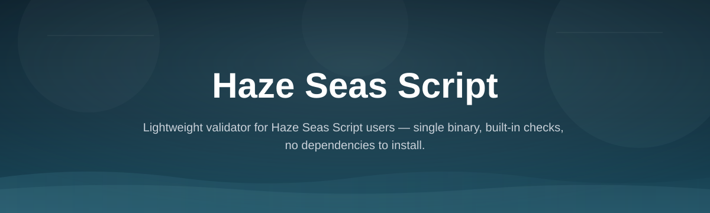
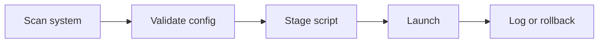

# haze-seas-val-toolkit

*A standalone launcher for the Haze Seas Script — built for players who want reliable setup without editing config files by hand.*

## What this is

The Haze Seas Script is a lightweight automation layer for the Haze Seas title, wrapped here in a toolkit that handles the parts players usually get wrong: launch order, permission prompts, and config placement. `haze-seas-val-toolkit` packages the script with a small launcher UI so you press one button instead of reading a wiki.

This isn't a fork or a rewrite of someone else's project. It's a validation and launch toolkit — it checks that your system meets the script's requirements, applies known-good settings, and starts the process cleanly. If you've searched for "Haze Seas Script" looking for the actual working version instead of a dead forum link, this is that.

  

The button opens the project's landing page, where the current build is downloaded.

## Who it is for

- Haze Seas players who want the script running without manual file edits
- Users returning after a game update broke their previous setup
- Anyone who tried a raw script copy and hit permission or path errors
- Low-spec Windows users who need a version that starts fast and stays light
- Server or clan organizers standardizing one setup across multiple machines

## What you can do

- **One-click launch** — start the script without touching a terminal
- **Auto-detect game path** — no manual folder hunting
- **Config validation** — flags missing or malformed settings before launch
- **Safe-mode toggle** — run a reduced feature set if the full script misbehaves
- **Update check** — confirms you're on the current build, not a stale copy
- **Log export** — one file to share when asking for help
- **Portable mode** — run from a USB drive, no install footprint left behind
- **Rollback** — revert to the last known-working config in one step

## Getting started

1. Open the landing page via the download button above.
2. Download the latest release archive.
3. Extract it to any folder — no installer runs.
4. Launch `haze-seas-val-toolkit.exe`.
5. Point it at your Haze Seas install folder when prompted, then start the script.

## Requirements

- Windows 10 or Windows 11 (64-bit)
- No admin rights required for standard mode
- No separate runtime, SDK, or toolchain install
- ~150 MB free disk space
- Haze Seas installed and closed before first launch

## How it works

1. Toolkit scans your system and the game install for compatibility.
2. It validates or repairs the script's config file.
3. It stages the script files in the expected runtime location.
4. It hands off execution and monitors for early crashes.
5. On success, it writes a log; on failure, it rolls back automatically.

## FAQ

**Is the Haze Seas Script safe to run on Windows Defender?**
The toolkit itself is unsigned and may trigger a SmartScreen prompt on first run. That's standard for small independent tools; check the log output if you want to verify what ran.

**Does this work after a Haze Seas game update?**
Usually. The toolkit checks script compatibility on launch and will warn you if the current build no longer matches the installed game version.

**Can I run the Haze Seas Script without this toolkit?**
Yes, but you'll need to place files and set permissions manually. This toolkit exists to remove that step and catch common mistakes.

**Why does the script fail to start even after installing correctly?**
Almost always a path mismatch — the toolkit's config validation step is built specifically to catch this before launch.

**Is there a version for macOS or Linux?**
Not currently. The toolkit and script are Windows-only; there's no timeline for other platforms.

## Troubleshooting

- **Launcher won't open** — right-click, "Run anyway" past the SmartScreen warning; the binary is unsigned but unmodified.
- **"Game path not found"** — manually browse to your Haze Seas install folder in the prompt instead of relying on auto-detect.
- **Script starts then closes immediately** — enable Safe-mode toggle, relaunch, and check the exported log for the failing step.
- **Config keeps resetting** — run the toolkit outside of any cloud-synced folder (OneDrive, Dropbox); sync conflicts overwrite the config file.

## License

MIT — see [MIT License](LICENSE). This project is provided as-is, with no warranty. You're responsible for how you use it with any third-party game or service.

  

